# 当前单图、bis与四panel合图

蜂窝边长固定为1；球直径0.10；**ket/bra两层对应球心距0.19**。层内相邻球心距离仍为1。两球表面间距离0.09，正好分为上灰腿0.03、留白0.03、下灰腿0.03。所有灰腿颜色为(160,160,160)、半径0.006。蓝色纯点线与粗圆柱统一为(110,150,255)。方形边长0.3，中心恢复原双小球中心。

投影为

\[
(x,y,z)\mapsto(-x+y/4,\ z+\sqrt3\,y/4).
\]

所以xz面的单位正方形仍是单位正方形，xy面成为内角60°/120°、短长边比1/2的平行四边形。+x朝画面左，+z朝上，+y斜向右上。球采用圆形球面示意符号。**所有圆柱和所有方形共同按真实逐像素射线深度相互遮挡，没有“方形永远在最上面”的规则。** 方形只在自身轮廓内遮挡相连细腿，粗χ圆柱始终比较真实深度。左侧透明网格是**25%不透明度的背景示意**，先绘制背景，再合成全部不透明前景。

## 第1步：单层PEPS

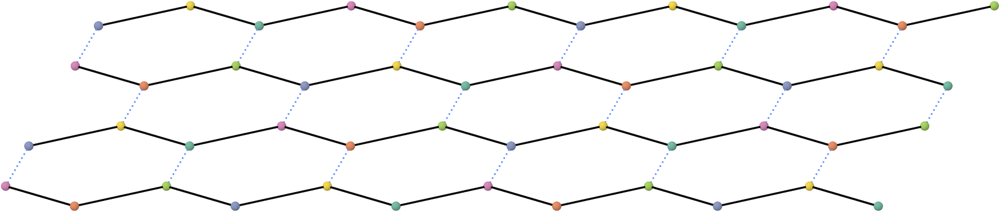

四行各12球；颜色依次为`cfabedcfabed / bedcfabedcfa / cfabedcfabed / bedcfabedcfa`。球对应`(alpha,beta,gamma,spin)`四腿张量；蓝点线是alpha键，黑线是zigzag虚键。a、b独立，c/e由a循环转腿得到，d/f由b循环转腿得到，未额外加入a=b或镜面对称。

## 第2步：ket/bra与红绿切口

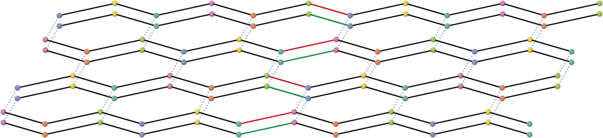

原图复制为上ket、下bra，层间距0.19。每行第6、7球之间上红下绿，各键仍由两条相等的半键组成，半键长度0.5。图中这一条切口左右颜色为`d/a`与`c/b`，交替穿过gamma/beta键。

## 第2_bis步：双层延伸

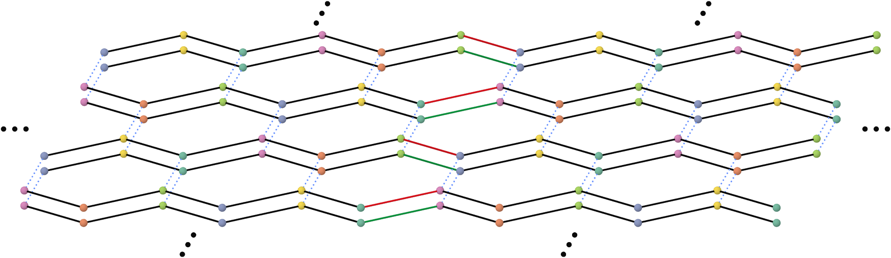

第2步左右各沿向外x及正负y增加三组省略号，共六组。不含第3步才出现的灰物理腿。此前已要求的含灰腿3_bis也保留。

## 第3步：物理腿

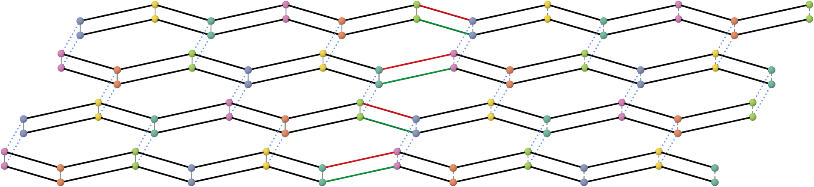

左侧灰线收缩同站点的ket/bra物理指标，维数2。右侧各球向对层留灰短腿，彼此不接，表示开放物理指标。

## 第3_bis步：在第3步加省略号


复用第3步的全部元素，包含已相连与开放的灰腿。左右各沿向外x及正负y添加三组省略号；概念射线不画。y方向的世界坐标点距取x方向的两倍，补偿y方向投影长度减半，故画面中的省略号点距一致。该图是支线。

## 第4步：两份网络的摆放

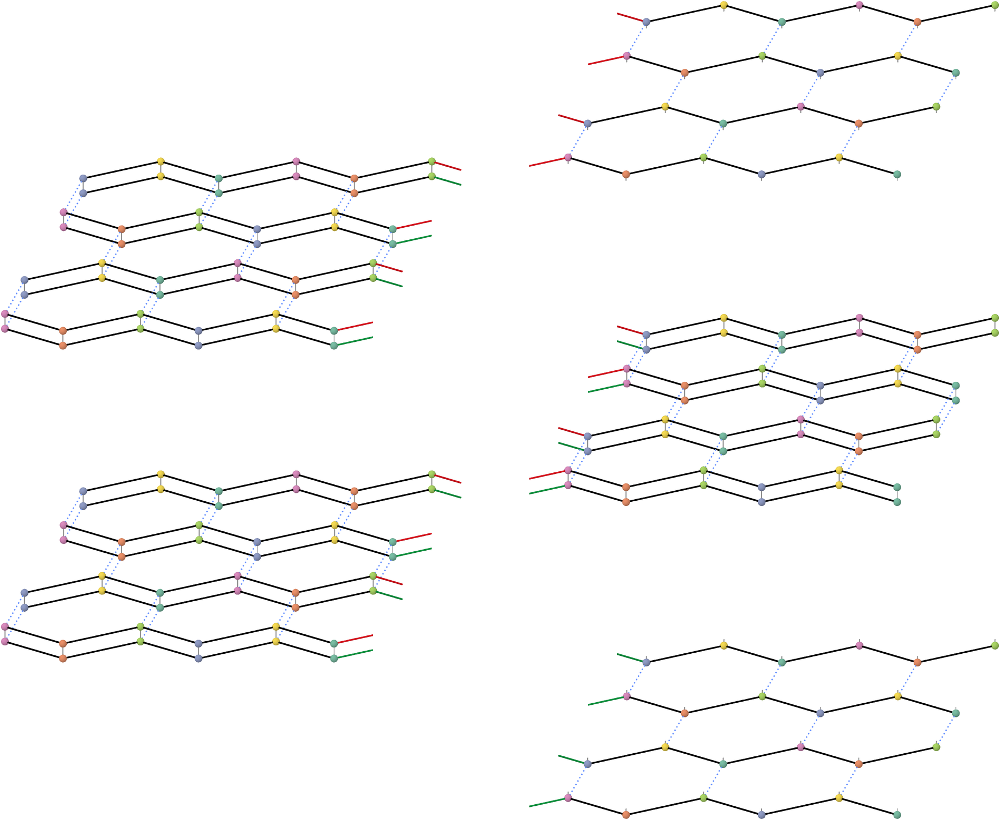

两个左侧完整双层、一个右侧完整双层、最上右ket层及最下右bra层。左副本下移4；右完整副本下移2、向右移2；右分离ket上移2、向右移2；右分离bra按已确认的最下方摆放改为下移6、向右移2。位移单位均为蜂窝边长1。

## 第5步：复制间的四组飞线

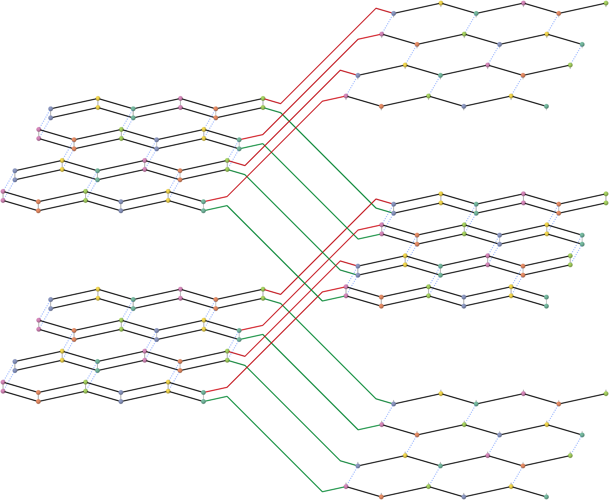

保留原半键，各组4条平行飞线连接自由端：

```text
左原ket ─红─ 右上ket
左原bra ─绿─ 右中bra
左副ket ─红─ 右中ket
左副bra ─绿─ 右下bra
```

## 第5_bis步：五个分离区域的延伸

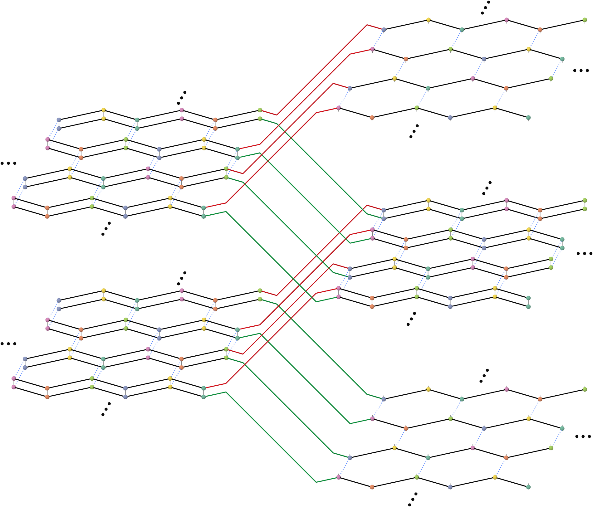

忽略飞线定位两左三右的五组区域。各自中心沿正负y、向外x射线添加三组省略号，共15组；射线不画。

## 第6步：单份CTM边界

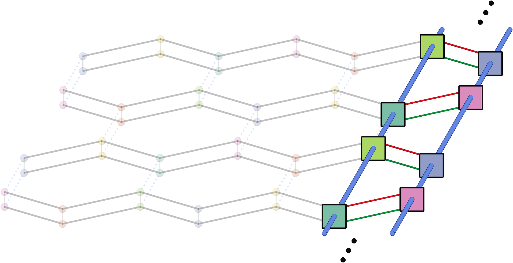

方形压缩已收缩物理腿的半平面环境；红绿半键保留。左右方形中心都恢复为**原边界ket/bra双小球的中点**，边长0.3、法向y；其轮廓遮挡相连细半键，χ圆柱与方形按真实深度相互遮挡。剩余左网格及灰腿作为25%不透明度底图。

每个方形是一个edge：原存储`(LMN,XYZ,ket*D+bra)`，shape`(chi,chi,D²)`。红、绿各一条原始D腿；蓝柱是chi腿。**第一chi轴LMN对应长柱2；第二chi轴XYZ对应短柱1。** 左γ→β接长柱，右γ→β接短柱，故两侧传播方向相反。两个端部延伸后左右蓝链总长均为6。

本图实际画pair1：normal env1的T1F/T2A和swap env1的T1F/T2A。完整三pair为`1/1、2/3、3/2`；颜色、切口与排列见[独立核对](env_pair_mapping.md)。

## 第6_bis步：左侧半平面延伸

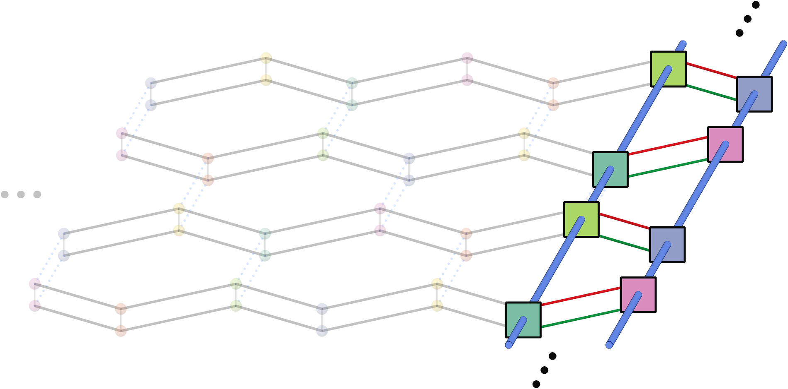

保留第6步两组y向省略号，左侧透明背景沿向外x再加一组25%不透明度省略号。

## 第7步：两份CTM replica网络

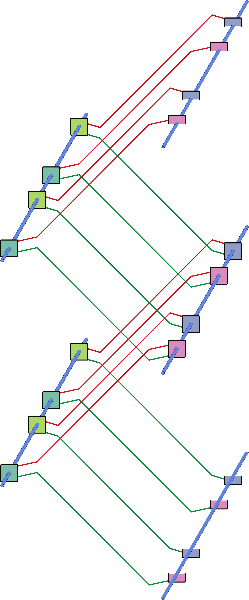

保留第5步红绿折线，已trace的完整环境换成12个完整方形。最上与最下另有8个半方形及半圆柱，合起来表示另外4个完整edge；**数值中没有腰斩张量**。右侧半方形以假设完整的双小球中点为完整方形中心，再取其上/下半片，腰线无额外边框。

沿y闭合后，第6步给`Z1=Tr(T1^(L/2))`；第7步给`Z2=Tr(T2^(L/2))`。当前脚本统一令L为偶数切键数，计算`S2(L)=-log(Z2)+2log(Z1)`。蜂窝边长1时几何周长为`3L/2`。

## 第7_bis步：五条完整/半柱链延伸

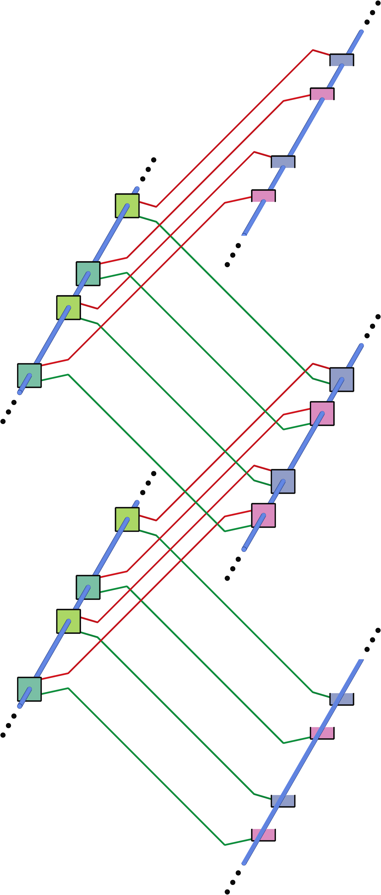

两条左完整链、一条右完整链、右上半链与右下半链，各沿正负y增加省略号，共10组。

## 四panel合图

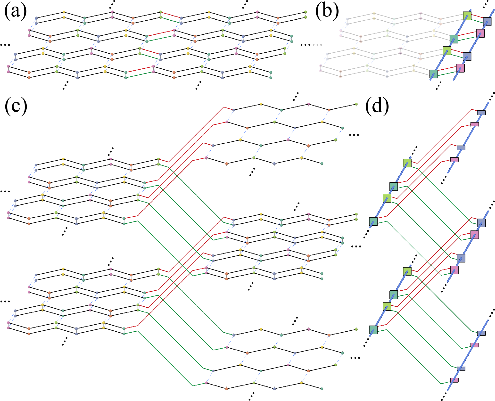

按已确认的选择，左上为含灰腿的3_bis、右上6_bis、左下5_bis、右下7_bis。每行两panel同高，两行等宽，两行的列分界独立；不强制十字对齐。仅合图有(a)(b)(c)(d)，字体为真正Times New Roman、10.5pt，整图宽3.4英寸，PNG为600dpi，PDF标签为嵌入字体的矢量文字。[PDF](figures/four_panel_bis.pdf)。

## 重画与文件

```powershell
python -B tmp_tee_schematic_20261009/build_schematics.py --width 1900
python -B tmp_tee_schematic_20261009/assemble_review.py
```

默认左上为带灰腿3_bis；另保留不含灰腿的2_bis单图。若需导出该备选合图，加`--first-panel 02_bis`，不需重画其他panel。

当前坐标在`coordinates/`，核验在`geometry_checks.json`及`algorithm_checks/projection_verification_v6.json`。单图PNG按图元边界仅留2像素边距，PDF按PNG同宽高导出，不另加留白。旧TEE归档、旧v2–v5绘图及测试专用CUDA环境列入本次实际清理；必要文献与迭代经验浓缩在[清理与历史记录](清理范围_20261009.md)。最终图、代码和正式数值证据全部保留。当前物理routine及精度状态见[明确结论](S2_routine明确结论.md)。
